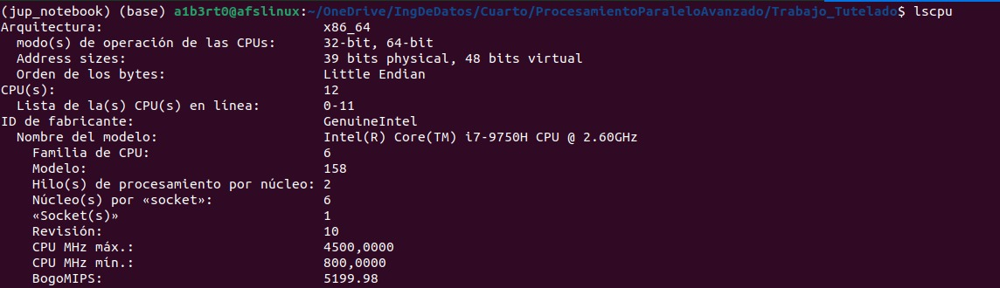
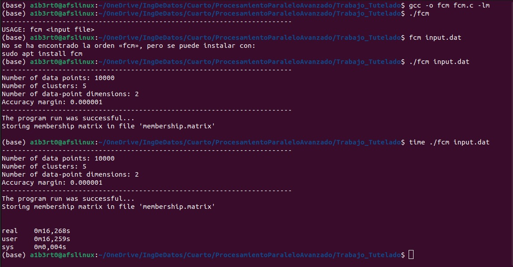
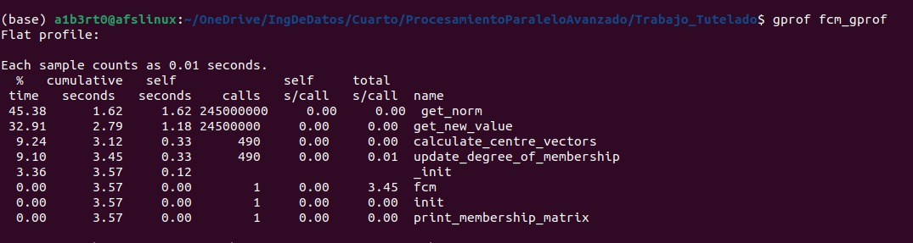
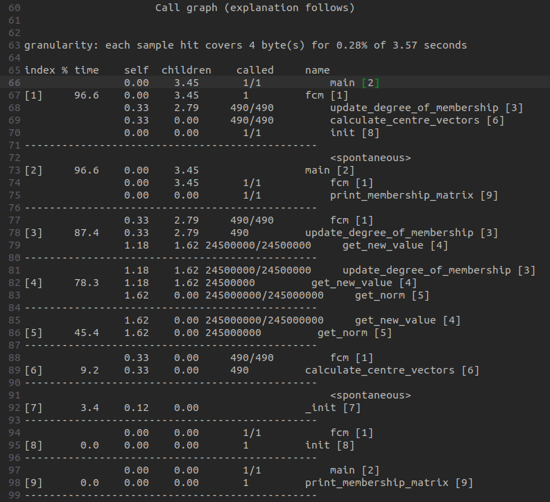

# Trabajo tutelado

Alberto Fernández Sánchez
alberto.fsanchez@udc.es


- [Introducción](#1-introducción)

- [Análisis](#2-análisis)

   - [Análisis de carga del script](#21-análisis-de-carga-del-script)
      - [Información general](#211-información-general)
      - [Información de carga](#212-información-de-carga)
   - [Análisis del código](#22-análisis-del-código)
      - [get_norm](#221-análisis-del-código-get_norm)
      - [get_new_value](#222-análisis-del-código-get_new_value)
      - [update_degree_of_membership](#223-análisis-del-código-update_degree_of_membership)
- [Paralelizado](#3-paralelizado)
- [Resultados](#4-resultados)
- [Conclusiones](#5-conclusiones)


# 1. Introducción 

En esta práctica hemos realizado el paralelizado de 1 archivos en lenguaje c con OpenMP, para ello hemos utilizado los recursos de la computadora Finisterrae III.

El trabajo tutelado consiste en la paralelización del programa fcm.c. Este programa implementa un método de clasificación no supervisado, el algoritmo de clasificación fuzzy c-means (fcm), que permite construir una partición difusa de los datos de entrada.

A diferencia de los algoritmos de clasificación tradicionales, como k-means o los clasificadores jerárquicos, que asignan cada punto del conjunto de datos de entrada a un único grupo, el algoritmo fcm asigna a cada punto un grado de pertenencia entre 0 y 1 para cada grupo.


# 2. Análisis
## 2.1 Análisis de carga del script

Para la paralelización primero hay que calcular la carga de cada una de las partes del código y las llamadas de unas funciones a otras para así poder saber cual es la mejor estrategia de paralelizado.

### 2.1.1 Información general

Primero ejecuto el código en local y de manera secuencial midiendo los tiempos, las especificaciones del equipo son:



Ejecución secuencial 



Como se puede ver el tiempo en un equipo normal tarda 16.2 segundos

### 2.1.2 Información de carga

Para poder ver la carga de cada una de las partes de la función utilizamos la función gprof




Al ejecutarlo obtengo estas dos gráficas:



Aquí podemos comprobar la secuencia de llamadas

1. La función `main`, que es la primera llama una vez a `fcm` tardando 3.45 segundos
2. La función `fcm` llama 490 veces a `update_degree_of_membership` tardando 3.45 segundos
3. La función `update_degree_of_membership` llama 245000000 veces a `get_new_value` tardando 3.45 segundos
4. La función `get_new_value` llama 245000000 veces a `get_norm` tardando 2.79 segundos
5. La función `get_norm` no llama a ninguna otra función, se ejecuta 245000000 veces tardando 1.62 segundos en total
6. La función `calculate_centre_vectors` es llamada por `fcm` 490 veces con un coste de tiempo de 0.33 segundos. Esta función es llamada de manera paralela a la secuencia de los puntos 1 al 5.

Como se puede comprobar, la carga principal está en `get_new_value` y `get_norm`, sus predecesoras principalmente basan su carga en las llamadas a estas funciones por lo que `get_norm` es la función candidata a ser la función de la que partir para el paralelizado y si se puede, extender el paralelizado a `get_new_value` dado que añade una carga de 1.18 segundos al tiempo de ejecución. 

Por otra parte también está la función `calculate_centre_vectors` que no pertenece a la secuencia principal y también es susceptible de ser paralelizada.


## 2.2 Análisis del código
### 2.2.1 Análisis del código (get_norm)

```c
double
get_norm(int i, int j) {
    int k;
    double sum = 0.0;
    for (k = 0; k < num_dimensions; k++) {
        sum += pow(data_point[i][k] - cluster_centre[j][k], 2);
    }
    return sqrt(sum);
}
```

Como podemos ver es un simple bucle anidado. A primera vista parece que sí se puede paralelizar con un bucle for simple porque cumple las tres características:

1. El número de iteraciones está prefijada por la función conocida `num_dimensions`
2. No existe ningún `go_to`,`break` o similar que pueda cambiar el número de iteraciones del bucle
3. La única variable que puede tener un conflicto de escritura es `sum` pero es una variable susceptible a paralelizar con reduction (única variable privada junto a `k` que es el índice del bucle) y por lo tanto este bucle sí es paralelizable.


### 2.2.2 Análisis del código (get_new_value)

```c
double
get_new_value(int i, int j) {
    int k;
    double t, p, sum;
    sum = 0.0;
    p = 2 / (fuzziness - 1);
    for (k = 0; k < num_clusters; k++) {
        t = get_norm(i, j) / get_norm(i, k);
        t = pow(t, p);
        sum += t;
    }
    return 1.0 / sum;
}
```

En este caso tenemos otro bucle, el cual cumple del mismo modo que el anterior con las reglas de paralelizado si la variable `sum` se paraleliza con reduction.


Además del tiempo de las dos llamadas a `get_norm`, esta función solo tiene que calcular la potencia de un número y luego su inversa, es por ello no añade ningún tiempo extra al tiempo de ejecución de `get_norm`.


### 2.2.3 Análisis del código (update_degree_of_membership)

```c
double
update_degree_of_membership() {
    int i, j;
    double new_uij;
    double max_diff = 0.0, diff;
    for (j = 0; j < num_clusters; j++) {
        for (i = 0; i < num_data_points; i++) {
            new_uij = get_new_value(i, j);
            diff = new_uij - degree_of_memb[i][j];
            if (diff > max_diff)
                max_diff = diff;
            degree_of_memb[i][j] = new_uij;
        }
    }
    return max_diff;
}
```

Aquí tenemos un bucle anidado, este bucle anidado tiene las iteraciones prefijadas y no hay elementos que salgan del bucle. 

Por último los elementos que se escriben son `new_uij` (privada), `degree_of_memb` (que no colisiona porque no se escribe la misma posición `ij` en dos iteraciones diferentes) y max_diff, la cual sí es un problema porque el `if` de una iteración puede ser un problema para otras iteraciones, si el valor de `diff` de otra iteración (de otro hilo) es mayor que el valor de `max_diff` almacenado y mayor que el de la iteración que estamos considerando y el valor de `diff` de la iteración del hilo que estamos considerando es también mayor que `max_diff`, entonces estaremos actualizando un valor de `max_diff` que no deberíamos. 

Si paralelizásemos sin esta consideración el valor `max_diff` que devuelve la función puede no ser el que tiene la diferencia máxima entre el valor que devuelve `get_new_value(i,j)` y el valor almacenado en `degree_of_memb[i][j]`


### 2.2.4 Análisis del código (calculate_centre_vectors)

```c
int
calculate_centre_vectors() {
    int i, j, k;
    double numerator, denominator;
    double t[MAX_DATA_POINTS][MAX_CLUSTER];
    for (i = 0; i < num_data_points; i++) {
        for (j = 0; j < num_clusters; j++) {
            t[i][j] = pow(degree_of_memb[i][j], fuzziness);
        }
    }
    for (j = 0; j < num_clusters; j++) {
        for (k = 0; k < num_dimensions; k++) {
            numerator = 0.0;
            denominator = 0.0;
            for (i = 0; i < num_data_points; i++) {
                numerator += t[i][j] * data_point[i][k];
                denominator += t[i][j];
            }
            cluster_centre[j][k] = numerator / denominator;
        }
    }
    return 0;
}
```

Aquí tenemos dos bucles anidados, este bucle anidado tiene las iteraciones prefijadas y no hay elementos que salgan del bucle. 

El primer bucle anidado escribe en la variable `t` en una posición diferente para cada iteración con lo que sería paralelizable.

Por otra parte el segundo bucle anidado tiene en su interior otro bucle más que calcula un agregado a las variables `numerator` y `denominator` para cada iteración y posteriormente a dicho agregado opera con el para calcular la posición `jk`de la matriz `cluster_centre`. Teniendo en cuenta que si fijamos una posición de `j` y otra de `k` lo que haría una iteración aislada del resto, podría calcular todos los valores del agregado `numerator` y `denominator` para posteriormente aplicarlos para calcular `cluster_centre` así que este bucle interior aunque a priori parece un problema de paralelizado no lo es si paralelizamos los bucles exteriores.


# 3. Paralelizado


# 4. Resultados


# 5. Conclusiones

| Num. Hilos      | 1     | 2     | 4    | 8    | 16   | 32   |
|-------|-------|-------|------|------|------|------|
| Mult  | 3.967 | 1.988 | 1.00 | 0.50 | 0.25 | 0.138|
| Pi    | 3.223 | 1.610 | 0.80 | 0.40 | 0.20 | 0.100|
| Mandel| 7.782 | 3.900 | 3.89 | 3.22 | 1.95 | 1.030|

