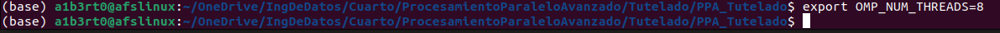
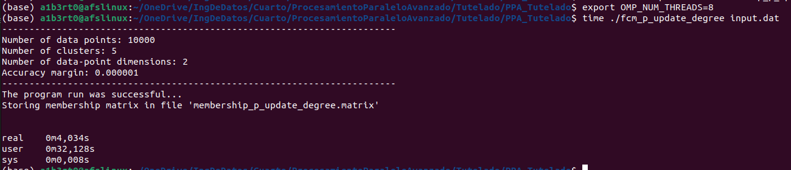
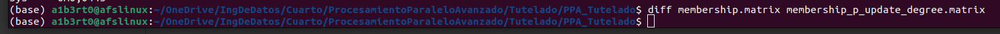
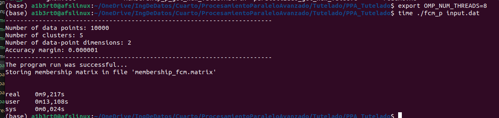
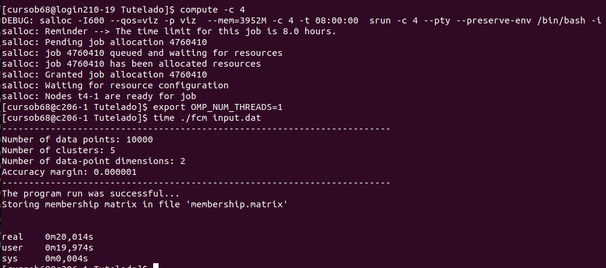
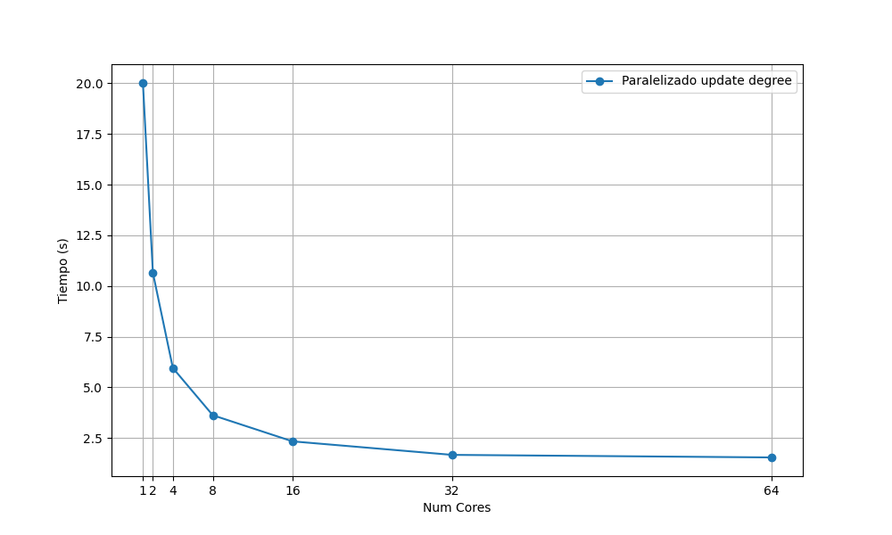

# Trabajo tutelado

Alberto Fernández Sánchez
alberto.fsanchez@udc.es


- [1. Introducción](#1-introducción)

- [2. Análisis](#2-análisis)

   - [2.1 Análisis de carga del script](#21-análisis-de-carga-del-script)
      - [2.1.1 Información general](#211-información-general)
      - [2.1.2 Información de carga](#212-información-de-carga)
   - [2.2 Análisis del código](#22-análisis-del-código)
      - [2.2.1 get_norm](#221-análisis-del-código-get_norm)
      - [2.2.2 get_new_value](#222-análisis-del-código-get_new_value)
      - [2.2.3 update_degree_of_membership](#223-análisis-del-código-update_degree_of_membership)
- [3. Paralelizado](#3-paralelizado)
    - [3.1 Paralelizado de la función get_norm](#31-paralelizado-de-la-funcion-get_norm)  
    - [3.2 Paralelizado de la función get_new_value](#32-paralelizado-de-la-funcion-get_new_value)  
    - [3.3 Paralelizado de la función update_degree_of_membership](#33-paralelizado-de-la-funcion-update_degree_of_membership) 
        - [3.3.1 Codigo](#331-código) 
        - [3.3.2 Tiempos](#332-tiempos) 
        - [3.3.3 Comprobación de la salida](#333-comprobando-la-salida) 
    - [3.4 Paralelizado de la función fcm](#34-paralelizado-de-la-funcion-fcm) 
        - [3.4.1 Código](#341-código) 
        - [3.4.2 Tiempos](#342-tiempos)
- [4. Paralelizado en el cluster de Finisterrae](#4-paralelizado-en-el-cluster-de-finisterrae)
    - [4.1 Conexión y ejecución](#41-conexión-a-un-nodo-de-64-cores-y-ejecución-por-batch)

- [5. Resultados](#5-resultados)
    - [5.1 Tiempos](#51-tiempos)
    - [5.2 Eficiencia y aceleración](#52-eficiencia-y-aceleración)
- [6. Conclusiones](#6-conclusiones)


# 1. Introducción 

En esta práctica hemos realizado el paralelizado de 1 archivos en lenguaje c con OpenMP, para ello hemos utilizado los recursos de la computadora Finisterrae III.

El trabajo tutelado consiste en la paralelización del programa fcm.c. Este programa implementa un método de clasificación no supervisado, el algoritmo de clasificación fuzzy c-means (fcm), que permite construir una partición difusa de los datos de entrada.

A diferencia de los algoritmos de clasificación tradicionales, como k-means o los clasificadores jerárquicos, que asignan cada punto del conjunto de datos de entrada a un único grupo, el algoritmo fcm asigna a cada punto un grado de pertenencia entre 0 y 1 para cada grupo.


# 2. Análisis
## 2.1 Análisis de carga del script

Para la paralelización primero hay que calcular la carga de cada una de las partes del código y las llamadas de unas funciones a otras para así poder saber cual es la mejor estrategia de paralelizado.

### 2.1.1 Información general

Primero ejecuto el código en local y de manera secuencial midiendo los tiempos, las especificaciones del equipo son:


Ejecución secuencial 


Como se puede ver el tiempo en un equipo normal tarda 16.2 segundos

### 2.1.2 Información de carga

Para poder ver la carga de cada una de las partes de la función utilizamos la función gprof


Al ejecutarlo obtengo estas dos gráficas:


Aquí podemos comprobar la secuencia de llamadas

1. La función `main`, que es la primera llama una vez a `fcm` tardando 3.45 segundos
2. La función `fcm` llama 490 veces a `update_degree_of_membership` tardando 3.45 segundos
3. La función `update_degree_of_membership` llama 245000000 veces a `get_new_value` tardando 3.45 segundos
4. a función `get_new_value` llama 245000000 veces a `get_norm` tardando 2.79 segundos
5. La función `get_norm` no llama a ninguna otra función, se ejecuta 245000000 veces tardando 1.62 segundos en total
6. La función `calculate_centre_vectors` es llamada por `fcm` 490 veces con un coste de tiempo de 0.33 segundos. Esta función es llamada de manera paralela a la secuencia de los puntos 1 al 5.

Como se puede comprobar, la carga principal está en `get_new_value` y `get_norm`, sus predecesoras principalmente basan su carga en las llamadas a estas funciones por lo que `get_norm` es la función candidata a ser la función de la que partir para el paralelizado y si se puede, extender el paralelizado a `get_new_value` dado que añade una carga de 1.18 segundos al tiempo de ejecución. 

Por otra parte también está la función `calculate_centre_vectors` que no pertenece a la secuencia principal y también es susceptible de ser paralelizada.


## 2.2 Análisis del código

El código comienza con la función `fcm`, la cual llama a dos funciones como se puede ver aquí

```c
int
fcm(char *fname) {
    double max_diff;
    init(fname);
    do {
        calculate_centre_vectors();
        max_diff = update_degree_of_membership();
    } while (max_diff > epsilon);
    return 0;
}
```
La secuencia principal del script que comienza con `fcm` es la siguiente:

- La función `fcm` llama a `update_degree_of_membership` tantas veces como dure el bucle while, con este input.dat llama un total de 490 veces.
- La función `update_degree_of_membership` llama a la función `get_new_value` un número de veces que es igual al valor de `num_clusters` (5) multiplicado por el valor de `data_points` (10000), lo que hace un total de 50.000 llamadas.

- La función `get_new_value` finalmente es la que llama a `get_norm`, la cual ejecuta 5 iteraciones llamando 2 veces a la función `get_norm` por cada iteración, un total de 10 llamadas.

Si multiplicamos todos los bucles tenemos 490(`fcm`) x 50.000(`update_degree_of_membership`) x 10(`get_new_value`) = 245.000.000 llamadas a la función `get_norm`

La función `fcm` llama además a `calculate_centre_vectors()` la cual se ejecuta únicamente las iteraciones del bucle while y no llama a ninguna función. 

Es por esto que este análisis comienza al final de la secuencia mencionada anteriormente con la función `get_norm`

### 2.2.1 Análisis del código (get_norm)

```c
double
get_norm(int i, int j) {
    int k;
    double sum = 0.0;
    for (k = 0; k < num_dimensions; k++) {
        sum += pow(data_point[i][k] - cluster_centre[j][k], 2);
    }
    return sqrt(sum);
}
```
A primera vista parece que sí se puede paralelizar `omp parallel for`  porque cumple las tres características:

1. El número de iteraciones está prefijada por la función conocida `num_dimensions`
2. No existe ningún `go_to`,`break` o similar que pueda cambiar el número de iteraciones del bucle
3. La única variable que puede tener un conflicto de escritura es `sum` pero es una variable susceptible a paralelizar con reduction y por lo tanto este bucle sí es paralelizable.


### 2.2.2 Análisis del código (get_new_value)

```c
double
get_new_value(int i, int j) {
    int k;
    double t, p, sum;
    sum = 0.0;
    p = 2 / (fuzziness - 1);
    for (k = 0; k < num_clusters; k++) {
        t = get_norm(i, j) / get_norm(i, k);
        t = pow(t, p);
        sum += t;
    }
    return 1.0 / sum;
}
```

En este caso tenemos otro bucle, el cual cumple del mismo modo que el anterior con las reglas de paralelizado si la variable `sum` se paraleliza con reduction.


Además del tiempo de las dos llamadas a `get_norm`, esta función solo tiene que calcular la potencia de un número y luego su inversa, es por ello no añade ningún tiempo extra al tiempo de ejecución de `get_norm`.


### 2.2.3 Análisis del código (update_degree_of_membership)

```c
double
update_degree_of_membership() {
    int i, j;
    double new_uij;
    double max_diff = 0.0, diff;
    for (j = 0; j < num_clusters; j++) {
        for (i = 0; i < num_data_points; i++) {
            new_uij = get_new_value(i, j);
            diff = new_uij - degree_of_memb[i][j];
            if (diff > max_diff)
                max_diff = diff;
            degree_of_memb[i][j] = new_uij;
        }
    }
    return max_diff;
}
```

Aquí tenemos un bucle anidado, este bucle anidado tiene las iteraciones prefijadas y no hay elementos que salgan del bucle. 

Por último los elementos que se escriben son `new_uij` (privada), `degree_of_memb` (que no colisiona porque no se escribe la misma posición `ij` en dos iteraciones diferentes) y max_diff, la cual sí es un problema porque el `if` de una iteración puede ser un problema para otras iteraciones, si el valor de `diff` de otra iteración (de otro hilo) es mayor que el valor de `max_diff` almacenado y mayor que el de la iteración que estamos considerando y el valor de `diff` de la iteración del hilo que estamos considerando es también mayor que `max_diff`, entonces estaremos actualizando un valor de `max_diff` que no deberíamos. 

Si paralelizásemos sin esta consideración el valor `max_diff` que devuelve la función puede no ser el que tiene la diferencia máxima entre el valor que devuelve `get_new_value(i,j)` y el valor almacenado en `degree_of_memb[i][j]`. Esto se puede arreglar también con reduction.


# 3. Paralelizado Local

Todas las pruebas de paralelizado de este apartado se han realizado fijando el número de hilos en 8 de los 12 disponibles en el equipo local.



## 3.1 Paralelizado de la funcion `get_norm`

Como la función `get_norm` tiene un bucle de 2 iteraciones no merece la pena paralelizarlo porque no sería escalable más allá de los 2 hilos, por lo tanto no se realiza su intento de paralelización


## 3.2 Paralelizado de la funcion `get_new_value`

Como la función `get_new_value` tiene un bucle de cinco iteraciones, al igual que con el anterior, no es escalable más allá de cinco hilos, por lo tanto se omite esta paralelización tal y como se hizo en el punto 3.1

## 3.3 Paralelizado de la funcion `update_degree_of_membership`

Eliminamos el paralelizado de la función anterior y paralelizamos únicamente esta función con 8 cores

### 3.3.1 Código

En esta paralelización tenemos un bucle anidado en el cual se quiere calcular el máximo de una diferencia, por lo demás son dos bucles perfectamente anidados los cuales no tienen conflictos entre si dado que la única variable que se escribe y debe ser compartida es `degree_of_memb` la cual dos iteraciones distintas nunca acceden a la misma localización de dicha variable. Por ello se utiliza la directiva collapse que permite la parlelización simultánea de bucles perfectamente anidados. Como variables privadas tenemos `i` y `j` al ser los índices de los bucles y también `diff` y `new_uij` dado que su valor es independiente para cada iteración. 

La variable `degree_of_memb` es una matriz a la que cada iteracción accede a una posición distinta de la matriz modificándola, por ello deberá ser compartida. 

Por último está la variable `max_diff`, la cual es el máximo entre todas las iteraciones, por ello se declara con el método `reduction` que permite combinar los resultados de los diferentes hilos para así hayar el máximo independientemente de qué hilo la modifique antes.

```c
double
update_degree_of_membership() {
    int i, j;
    double new_uij;
    double max_diff = 0.0, diff;
    #pragma omp parallel private(i,j,diff,new_uij) shared(degree_of_memb) reduction(max:max_diff)
    #pragma omp for collapse(2)
    for (j = 0; j < num_clusters; j++) {
        for (i = 0; i < num_data_points; i++) {
            new_uij = get_new_value(i, j);
            diff = new_uij - degree_of_memb[i][j];
            if (diff > max_diff)
                max_diff = diff;
            degree_of_memb[i][j] = new_uij;
        }
    }
    return max_diff;
}
```

### 3.3.2 Tiempos

Como podemos comprobar en la siguiente gráfica



El tiempo global de la ejecución del programa ha pasado de 16 segundos a 4 segundos.


### 3.3.3 Comprobando la salida

Para poder comprobar que la salida del script sigue siendo se modifica la función para que el archivo se guarde con un nombre diferente al secuencial y así poder tener la salida de cada paralelización en archivos distintos

```c
print_membership_matrix("membership_p_update_degree.matrix");

printf
        ("------------------------------------------------------------------------\n");
printf("The program run was successful...\n");
printf("Storing membership matrix in file 'membership_p_update_degree.matrix'\n\n");
```

posteriormente se comprueba con el comando `diff`:




Como se puede comprobar, no hay diferencias en la salida con el secuencial, por lo tanto la paralelización es correcta. Este código es válido para testearlo en remoto.

### 3.4 Paralelizado de la funcion `fcm`

Eliminamos el paralelizado de la función anterior y paralelizamos únicamente esta función con 8 cores

### 3.4.1 Código

En esta función el único problema es que el bucle no tiene el número de iteraciones definidas, por lo tanto no se puede abordar como si fuese un bucle for, para poder paralelizarlo debemos usar las directivas task, como la condición de salida del bucle es una condición, dicha condición se pone como final en la directiva task.

```c
int
fcm(char *fname) {
    double max_diff;
    init(fname);
    #pragma omp parallel
    #pragma omp single nowait
    do {
        #pragma omp task final(max_diff > epsilon)
        calculate_centre_vectors();
        max_diff = update_degree_of_membership();
    } while (max_diff > epsilon);
    return 0;
}
```

### 3.4.2 Tiempos

Como podemos comprobar en la siguiente gráfica



El tiempo global de la ejecución del programa ha pasado de 16 segundos a 9.21 segundos.

Puesto que esta paralelización da un resultado mucho peor que el de la paralelización de la función `update_degree_of_membership` se descarta la paralelización de esta función y se testea el paralelizado de `update_degree_of_membership` en el Finisterrae.

# 4. Paralelizado en el cluster de Finisterrae

## 4.1 Conexión a un nodo de 64 cores y ejecución por batch


Para el paralelizado primero se ha creado un bash que permite ejecutar de manera iterativa con varios cores diferentes y registrar la media de 5 mediciones de tiempo por cada selección de cores.

Se indica el número de cores, el tiempo máximo, la memoria y que son nodos exclusivos dentro del propio bash.

```bash
#!/bin/bash
#SBATCH -c 64
#SBATCH -t 00:10:000 #(10 min of execution time)
#SBATCH --mem=1G #(4GB of memory)
#SBATCH --exclusive

export LC_NUMERIC="en_US.UTF-8" # si no no me devuelve bien los decimales
mkdir -p results_tutelado

# Ejecuta el comando 3 veces con el comando time
for i in 1 2 4 8 16 32 64
do
        > "results_tutelado/prueba_tutelado_${i}.txt"
        export OMP_NUM_THREADS=$i
        total_time=0
        for j in {1..5}
        do
                echo "Ejecución $j para OMP_NUM_THREADS=$i"
                execution_time=$( (time -p ./paralelizado_update_degree input.dat) 2>&1 | grep real | awk '{printf "%.4f", $2}' )
                echo "Tiempo real de ejecución $j: $execution_time"
                echo "Tiempo real de ejecución $j: $execution_time" >> "results_tutelado/prueba_tutelado_${i}.txt"
                total_time=$(awk "BEGIN {print $total_time + $execution_time}")
                echo "---------------------------------"
        done
        average_time=$(awk "BEGIN {print $total_time / 5}")

        echo ""
        echo "Media: $average_time"

        echo "" >> "results_tutelado/prueba_tutelado_${i}.txt"
        echo "Media: $average_time" >> "results_tutelado/prueba_tutelado_${i}.txt"
done

```

# 5 Resultados

## 5.1 Tiempos

Primero se ejecuta en secuencial para ver tiempos




Posteriormente se obtuvieron los tiempos medios de 5 ejecuciones para cada selección de cores

| Num. Hilos      | 1     | 2     | 4    | 8    | 16   | 32   | 64 |
|-------|-------|-------|------|------|------|------| ------ |
| Tiempos medios en segundos | 20.014 | 10.648 | 5.956 | 3.626 | 2.336 | 1.67 | 1.544 |




## 5.2 Eficiencia y aceleración

Cálculo de eficiencia y aceleración

| Paralelizado update degree | Aceleracion | Eficiencia |
|---------------------------|------------|---------------------------------------|
| 1                         | 1.00       | 100.00                                |
| 2                         | 1.88       | 93.98                                 |
| 4                         | 3.36       | 84.01                                 |
| 8                         | 5.52       | 68.99                                 |
| 16                        | 8.57       | 53.55                                 |
| 32                        | 11.98      | 37.45                                 |
| 64                        | 12.96      | 20.25                                 |


# 6. Conclusiones

Como se puede comprobar, el paralelizado de este código pierde mucha eficiencia a partir de 4 hilos, esto puede ser debido al tiempo del código no paralelizado. 

En este caso la función principal hace dos llamadas, una función no paralelizada y otra que sí está paralelizada. Al disminuir el tiempo ejecución de una parte del código debido a su paralelización, el peso del tiempo de ejecución del código que no está paralelizado aumenta (dado que permanece invariable al número de cores) y esto refleja una bajada de la eficiencia. 

Si tuviésemos infinitos cores llegaría un punto que el tiempo no puede bajar más (aunque se hiciese con un código de paralelización mucho más optimizado que este) debido a la parte de código que se ejecuta en secuencial, esta asíntota se puede percibir en la gráfica de tiempos.


